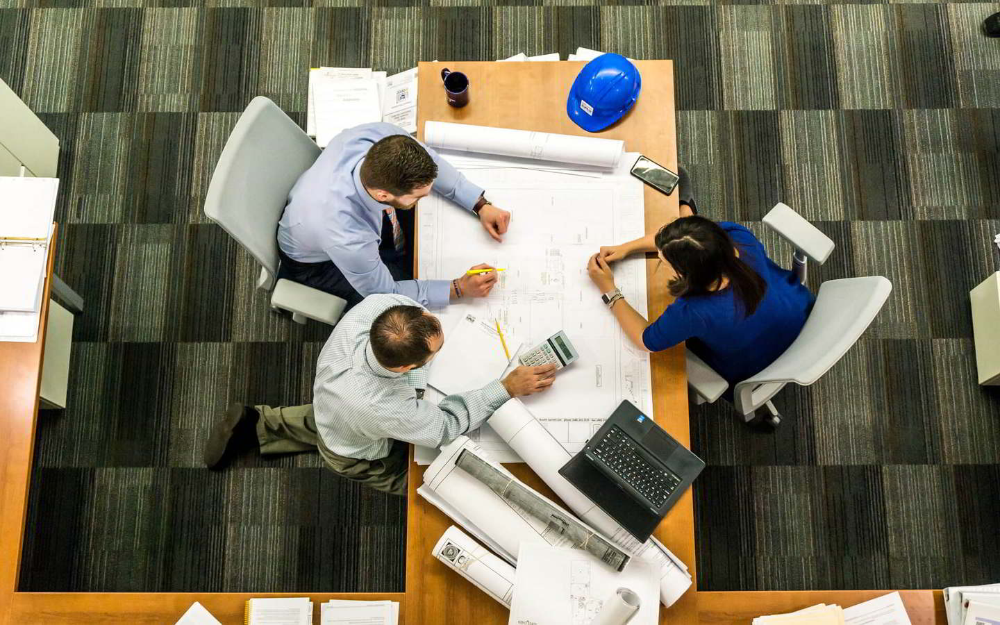

<!DOCTYPE html>
<html lang="en">
<head>
  <meta charset="utf-8">
  <title>The Maal - Prestação de Serviços</title>
  <meta content="width=device-width, initial-scale=1.0" name="viewport">
  <meta content="" name="keywords">
  <meta content="" name="description">
  <link href="css/gerais.css" rel="stylesheet">
  <link href="lib/animate/animate.min.css" rel="stylesheet">
  <link href="lib/ionicons/css/ionicons.min.css" rel="stylesheet">
  <link href="css/style.css" rel="stylesheet">

</head>

<body>

  <header id="header">
    

      

        <h1><a href="" class="scrollto">The Maal</a></h1>
      

      <nav id="nav-menu-container">
        <ul class="nav-menu">
          <li class="menu-active"><a href="#intro">Inicio</a></li>
          <li><a href="#about">Sobre</a></li>
          <li><a href="#services">Serviços</a></li>
          <li><a href="#team">Equipa</a></li>
          <li><a href="#contact">Contacto</a></li>
        </ul>
      </nav>
    

  </header>

  <section id="intro">
    

      

        <ol class="carousel-indicators"></ol>

        

          

            

            

              

                <h2>Soluções de TI</h2>
                
Disponibilizamos para os nossos clientes serviços de soluções de TI (Tecnologias de Informação)

              

            

          

          

            

            

              

                <h2>Qualificação Técnica</h2>
                
Prestamos um serviço completo de formação e qualificação na área tecnológica

              

            

          

          

            

            

              

                <h2>Suporte Técnico</h2>
                
Estamos disponíveis para prestar todo tipo de suporte técnico, para individuais e para empresas

              

            

          

        

        <a class="carousel-control-prev" href="#introCarousel" role="button" data-slide="prev">
          
        </a>

        <a class="carousel-control-next" href="#introCarousel" role="button" data-slide="next">
          
        </a>

      

    

  </section>

  <main id="main">

    <section id="about">
      

        <header class="section-header">
          <h3>Sobre nós</h3>
          
Somos uma equipa de jovens informáticos empreendedores, que decidiu unir esforços para alcançar objectivos e metas que temos em comum.

        </header>

        

          

            

              

                
                
<i class="ion-ios-speedometer-outline"></i>

              

              <h2 class="title"><a href="#">Nossa Missão</a></h2>
              

              Nossa missão é proporcionar um conjunto serviço de prestação de serviços com alta qualidade e a um preço acessível, melhorando o mercado e trazendo competitividade para o mesmo.
              

            

          

          

            

              

                
                
<i class="ion-ios-list-outline"></i>

              

              <h2 class="title"><a href="#">Nosso Plano</a></h2>
              

                Nosso plano é de ir aumentando gradualmente o nosso leque de serviços, no entanto, sem afetar a nossa prestatividade, nem a qualidade dos nossos serviços, garantindo sempre o melhor para sí.
              

            

          

          

            

              

                
                
<i class="ion-ios-eye-outline"></i>

              

              <h2 class="title"><a href="#">Nossa Visão</a></h2>
              

              Nossa visão é que daqui a algum tempo possamos ser reconhecidos pela qualidade de nosso trabalho e que possamos atingir um eleado patamar no mercado nacional e internacional.
              

            

          

        

      

    </section>

    <section id="services">
      

        <header class="section-header wow fadeInUp">
          <h3>Serviços</h3>
          
Proporcionamos aos nossos clientes um vasto leque de serviços de alta qualidade, dentre os quais podemos destcar:

        </header>

        

          

            
<i class="ion-ios-analytics-outline"></i>

            <h4 class="title"><a href="">Manutenção de computadores</a></h4>
            
Fazemos a instalação e manutenção de todo tipo de computadores, e reparamos ainda problemas no software e no hardware.

          

          

            
<i class="ion-ios-bookmarks-outline"></i>

            <h4 class="title"><a href="">Criação de aplicativos</a></h4>
            
Criamos e fazemos a gestão de todo o tipo de apliicativos, tanto mobile quanto desktop, para individuais ou empresas.

          

          

            
<i class="ion-ios-paper-outline"></i>

            <h4 class="title"><a href="">Criação de WEB sites</a></h4>
            
Criamos e gerimos todo o tipo de web sites, desde estáticos à dinámicos, e fazemos ainda a atualização de sites já existentes.

          

          

            
<i class="ion-ios-speedometer-outline"></i>

            <h4 class="title"><a href="">Sistemas de segurança</a></h4>
            
Criamos, montamos e gerimos todo o tipo de sistemas de segurança, desde videovigilância até sistemas de segurança biométrica.

          

          

            
<i class="ion-ios-barcode-outline"></i>

            <h4 class="title"><a href="">Localização</a></h4>
            
Instalamos e monitoramos sistemas de GPS em todo território nacional, para todo o tipo de viaturas, e proporcionamos um serviço de atendimento ao cliente 24/7.

          

          

            
<i class="ion-ios-people-outline"></i>

            <h4 class="title"><a href="">Qualificação técnica</a></h4>
            
Formamos e qualificamos pessoas na área técnica, e proporcionamos ainda estágio na empresa para os melhores formandos.

          

        

      

    </section>

    <section id="testimonials" class="section-bg wow fadeInUp">
      

        <header class="section-header">
          <h3>TEstemunhos</h3>
        </header>

        

            

                

                    
                    <h3>Sara André</h3>
                    <h4>Designer gráfica</h4>
                    

                      Fui uma das formandas da The Maal, e logo que terminei o curso e o estágio tive o privilégio de ter o meu primeiro emprego, onde estou até hoje.
                    

                

                

                   
                   <h3>Marcia Carvalho</h3>
                   <h4>Proprietária de loja</h4>
                   

                     Desde que a minha loja passou a usar o sistema de gestão da The Maal, passamos a ter melhor gestão dos nossos lucros, e consequentemente não paramos de crescer.
                   

                

                

                   
                   <h3>Bráulio Lourenço</h3>
                   <h4>Empreendedor , biscateiro e pambaleiro</h4>
                   

                     Eu contratei os serviços da The Maal para fazerem a instalação dos computadores da minha instituição de ensino, e de facto, tudo corre as mil maravilhas.
                   

                

            

        

      

    </section>

    <section id="team">
      

        

          <h3>Equipa</h3>
          
Temos disponível para sí uma equipe técnica altamente qualificada para atender a demanda e aos desafios diários por nós enfrentados.

        

        

          

            

              
              

                

                  <h4>Lourenço António</h4>
                  Desenvolvedor web FullStack, DBA e administrador de redes   <strong>CEO</strong>
                  

                    <a href=""><svg style="height: 20px" xmlns="http://www.w3.org/2000/svg" viewBox="0 0 320 512"><path d="M279.14 288l14.22-92.66h-88.91v-60.13c0-25.35 12.42-50.06 52.24-50.06h40.42V6.26S260.43 0 225.36 0c-73.22 0-121.08 44.38-121.08 124.72v70.62H22.89V288h81.39v224h100.17V288z"/></svg></a>
                    <a href=""><svg style="height: 20px;" xmlns="http://www.w3.org/2000/svg" viewBox="0 0 512 512"><path d="M464 64H48C21.49 64 0 85.49 0 112v288c0 26.51 21.49 48 48 48h416c26.51 0 48-21.49 48-48V112c0-26.51-21.49-48-48-48zm0 48v40.805c-22.422 18.259-58.168 46.651-134.587 106.49-16.841 13.247-50.201 45.072-73.413 44.701-23.208.375-56.579-31.459-73.413-44.701C106.18 199.465 70.425 171.067 48 152.805V112h416zM48 400V214.398c22.914 18.251 55.409 43.862 104.938 82.646 21.857 17.205 60.134 55.186 103.062 54.955 42.717.231 80.509-37.199 103.053-54.947 49.528-38.783 82.032-64.401 104.947-82.653V400H48z"/></svg></a>
                  

                

              

            

          

          

            

              
              

                

                  <h4>Ariclene Queta</h4>
                  Mestre em Hardware e administrador de redes   <strong>Diretor Geral</strong>
                  

                    <a href=""><svg style="height: 20px" xmlns="http://www.w3.org/2000/svg" viewBox="0 0 320 512"><path d="M279.14 288l14.22-92.66h-88.91v-60.13c0-25.35 12.42-50.06 52.24-50.06h40.42V6.26S260.43 0 225.36 0c-73.22 0-121.08 44.38-121.08 124.72v70.62H22.89V288h81.39v224h100.17V288z"/></svg></a>
                    <a href=""><svg style="height: 20px;" xmlns="http://www.w3.org/2000/svg" viewBox="0 0 512 512"><path d="M464 64H48C21.49 64 0 85.49 0 112v288c0 26.51 21.49 48 48 48h416c26.51 0 48-21.49 48-48V112c0-26.51-21.49-48-48-48zm0 48v40.805c-22.422 18.259-58.168 46.651-134.587 106.49-16.841 13.247-50.201 45.072-73.413 44.701-23.208.375-56.579-31.459-73.413-44.701C106.18 199.465 70.425 171.067 48 152.805V112h416zM48 400V214.398c22.914 18.251 55.409 43.862 104.938 82.646 21.857 17.205 60.134 55.186 103.062 54.955 42.717.231 80.509-37.199 103.053-54.947 49.528-38.783 82.032-64.401 104.947-82.653V400H48z"/></svg></a>
                  

                

              

            

          

          

            

              
              

                

                  <h4>José Abrantes</h4>
                  Designer gráfico   <strong>Gestor Financeiro</strong>
                  

                    <a href=""><svg style="height: 20px" xmlns="http://www.w3.org/2000/svg" viewBox="0 0 320 512"><path d="M279.14 288l14.22-92.66h-88.91v-60.13c0-25.35 12.42-50.06 52.24-50.06h40.42V6.26S260.43 0 225.36 0c-73.22 0-121.08 44.38-121.08 124.72v70.62H22.89V288h81.39v224h100.17V288z"/></svg></a>
                    <a href=""><svg style="height: 20px;" xmlns="http://www.w3.org/2000/svg" viewBox="0 0 512 512"><path d="M464 64H48C21.49 64 0 85.49 0 112v288c0 26.51 21.49 48 48 48h416c26.51 0 48-21.49 48-48V112c0-26.51-21.49-48-48-48zm0 48v40.805c-22.422 18.259-58.168 46.651-134.587 106.49-16.841 13.247-50.201 45.072-73.413 44.701-23.208.375-56.579-31.459-73.413-44.701C106.18 199.465 70.425 171.067 48 152.805V112h416zM48 400V214.398c22.914 18.251 55.409 43.862 104.938 82.646 21.857 17.205 60.134 55.186 103.062 54.955 42.717.231 80.509-37.199 103.053-54.947 49.528-38.783 82.032-64.401 104.947-82.653V400H48z"/></svg></a>
                  

                

              

            

          

          

            

              
              

                

                  <h4>Marcelo Mukongo</h4>
                  Desenvolvedor mobile   <strong>Diretor de Marketing</strong>
                  

                    <a href=""><svg style="height: 20px" xmlns="http://www.w3.org/2000/svg" viewBox="0 0 320 512"><path d="M279.14 288l14.22-92.66h-88.91v-60.13c0-25.35 12.42-50.06 52.24-50.06h40.42V6.26S260.43 0 225.36 0c-73.22 0-121.08 44.38-121.08 124.72v70.62H22.89V288h81.39v224h100.17V288z"/></svg></a>
                    <a href=""><svg style="height: 20px;" xmlns="http://www.w3.org/2000/svg" viewBox="0 0 512 512"><path d="M464 64H48C21.49 64 0 85.49 0 112v288c0 26.51 21.49 48 48 48h416c26.51 0 48-21.49 48-48V112c0-26.51-21.49-48-48-48zm0 48v40.805c-22.422 18.259-58.168 46.651-134.587 106.49-16.841 13.247-50.201 45.072-73.413 44.701-23.208.375-56.579-31.459-73.413-44.701C106.18 199.465 70.425 171.067 48 152.805V112h416zM48 400V214.398c22.914 18.251 55.409 43.862 104.938 82.646 21.857 17.205 60.134 55.186 103.062 54.955 42.717.231 80.509-37.199 103.053-54.947 49.528-38.783 82.032-64.401 104.947-82.653V400H48z"/></svg></a>
                  

                

              

            

          

        

      

    </section>

    <section id="contact" class="section-bg wow fadeInUp">
      

        

          <h3>Contacte-nos</h3>
          
Envie uma mensagem detalhada sobre o seu problema, que nós iremos entrar em contacto consigo, e resolver o seu problema.

        

        

          

            

              <i class="ion-ios-location-outline"></i>
              <h3>Endereço</h3>
              <address>Rua 123, Maianga, Luanda - Angola</address>
            

          

          

            

              <i class="ion-ios-telephone-outline"></i>
              <h3>Telefone</h3>
              
<a href="tel:+244912345678">+244 912 345 678</a>

            

          

          

            

              <i class="ion-ios-email-outline"></i>
              <h3>Email</h3>
              
<a href="mailto:info@example.com">info@maal.com</a>

            

          

        

        

          
A sua mensagem foi enviada, obrigado!

          

          <form action="" method="post" role="form" class="contactForm">
            

              

                <input type="text" name="name" class="form-control" id="name" placeholder="Seu nome" />
              

              

                <input type="email" class="form-control" name="email" id="email" placeholder="Seu Email" />
              

            

            

              <input type="text" class="form-control" name="subject" id="subject" placeholder="Assunto" />
            

            

              <textarea class="form-control" name="message" rows="5" placeholder="Mensagem"></textarea>
            

            
<button type="submit">Enviar mensagem</button>

          </form>
        

      

    </section>

  </main>

  <footer id="footer">
    

      

        

          

            <h3>The Maal</h3>
            
Somos uma equipa de jovens informáticos empreendedores, que decidiu unir esforços para alcançar metas e objectivos que temos em comum.

          

          

            <h4>Links úteis</h4>
            <ul>
              <li><i class="ion-ios-arrow-right"></i> <a href="#">Sobre</a></li>
              <li><i class="ion-ios-arrow-right"></i> <a href="#">Termos e Condições</a></li>
              <li><i class="ion-ios-arrow-right"></i> <a href="#">Política de privacidade</a></li>
            </ul>
          

          

            <h4>Contacte-nos</h4>
            

              Rua 123, Maianga, Luanda - Angola 
              <strong>Telefone:</strong>+244 912 345 678 
              <strong>Email:</strong> info@maal.com 
            

            

              <a href="#" class="twitter"><svg style="height: 20px" xmlns="http://www.w3.org/2000/svg" viewBox="0 0 320 512"><path d="M279.14 288l14.22-92.66h-88.91v-60.13c0-25.35 12.42-50.06 52.24-50.06h40.42V6.26S260.43 0 225.36 0c-73.22 0-121.08 44.38-121.08 124.72v70.62H22.89V288h81.39v224h100.17V288z"/></svg></a>
              <a href="#" class="facebook"><svg style="height: 20px;" xmlns="http://www.w3.org/2000/svg" viewBox="0 0 512 512"><path d="M464 64H48C21.49 64 0 85.49 0 112v288c0 26.51 21.49 48 48 48h416c26.51 0 48-21.49 48-48V112c0-26.51-21.49-48-48-48zm0 48v40.805c-22.422 18.259-58.168 46.651-134.587 106.49-16.841 13.247-50.201 45.072-73.413 44.701-23.208.375-56.579-31.459-73.413-44.701C106.18 199.465 70.425 171.067 48 152.805V112h416zM48 400V214.398c22.914 18.251 55.409 43.862 104.938 82.646 21.857 17.205 60.134 55.186 103.062 54.955 42.717.231 80.509-37.199 103.053-54.947 49.528-38.783 82.032-64.401 104.947-82.653V400H48z"/></svg></a>
            

          

          

            <h4>Newsletter</h4>
            
Subscreva a nossa newsletter para que possa receber um email sempre que tivermos alguma novidade!

            <form action="" method="post">
              <input type="email" name="email"><input type="submit"  value="Subscrever">
            </form>
          

        

      

    

    

      

        &copy; Copyright <strong>The Maal </strong>2021 Todos os direitos reservados
      

      

    

  </footer><!-- #footer -->

  <!-- Uncomment below i you want to use a preloader -->
  <!-- 

 -->

  <!-- JavaScript Libraries -->
  
  <!-- Carrossel Inicial -->
  
  
  
  

  <!-- Template Main Javascript File -->
  

</body>
</html>